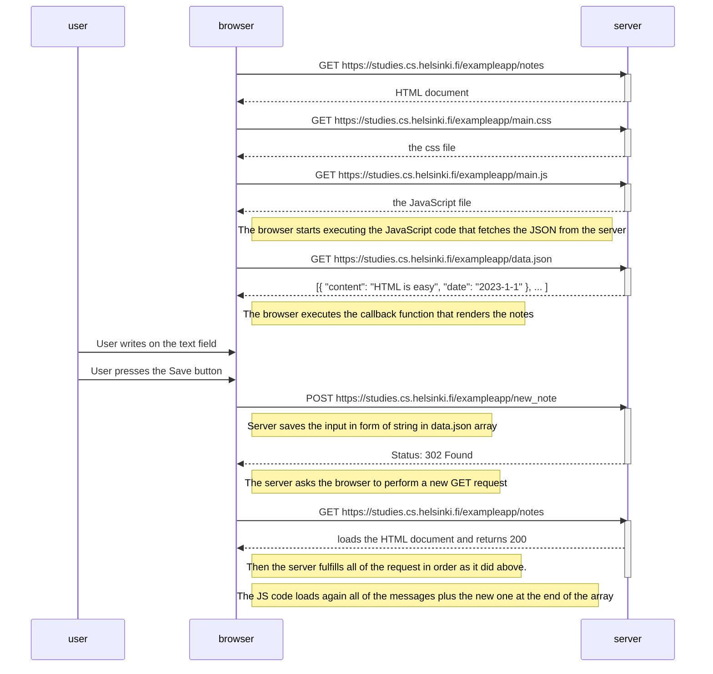
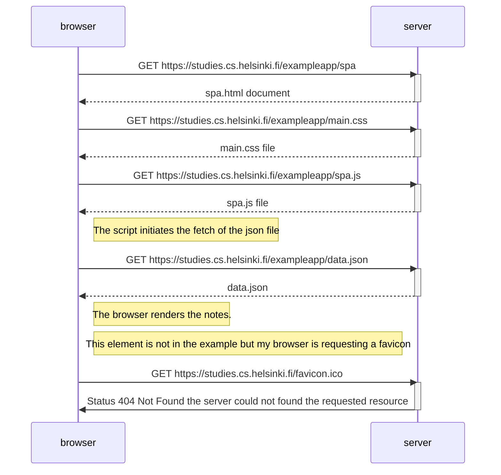

0.4: New note diagram



0.5: Single page app diagram



0.6: New note in Single page app diagram

```mermaid
sequenceDiagram
participant server
participant browser
participant jscode

browser->>jscode: Sending the input immediately calls the event handler that prevents the GET request of the browser
jscode-->>browser: The input is formatted into a new note and pushed/added to the nodes list
Note right of browser: Also the script calls redrawNotes() to redraw the notes on the page, and sendToServer(note) to initiate a POST

browser->>server: POST https://studies.cs.helsinki.fi/exampleapp/new_note_spa
Note right of browser: the new note is Posted as json data
activate server
server-->>browser: Status 201 and json: message:	"note created"
deactivate server
